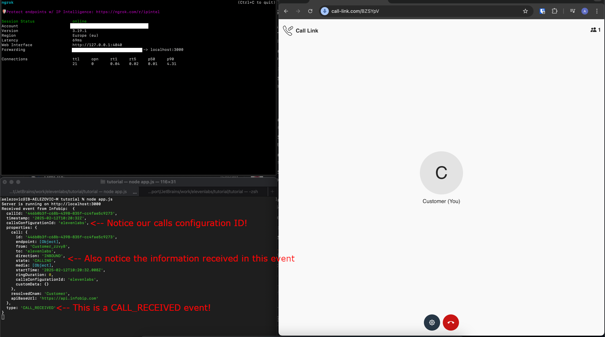

# Connecting your customers with ElevenLabs AI Agents through Infobip


With the emergence of conversational AI platforms, such as [ElevenLabs](https://elevenlabs.io/docs/conversational-ai/overview),
businesses can now provide their customers with a more personalized and engaging experience. 
In this guide you will learn how to connect your customers with ElevenLabs AI Agents through Infobip, by using
[Infobip Calls API](https://www.infobip.com/docs/voice-and-video/calls) for call orchestration and
[audio streaming over Websocket](https://www.infobip.com/docs/voice-and-video/calls#media-streaming-understanding-calls-api)
for exchanging audio with your AI agent.

---

ℹ️ The code used by the end of this tutorial is located in the [projects](projects) subdirectory.

---

## Prerequisites

Before you begin, you need to have the following:

- An [Infobip account](https://www.infobip.com/signup)
- An [ElevenLabs account](https://elevenlabs.io/signup)
- For local testing, we will use [ngrok](https://ngrok.com/download) to expose our local server to the internet.

## Overview

In order to use Calls API we first need a backend application for call orchestration. This application will be
responsible for handling events from Infobip and performing actions like connecting two calls together.

## Preparing your Infobip account

### Acquiring an API key

Once you signed up for an Infobip account, you can go straight to [API keys](https://portal.infobip.com/dev/api-keys)
and create one for your application. You will need this key to authenticate your requests towards Calls API.

When creating the API key, make sure to select the following API scope:
- `calls:traffic:send` - To create an outbound call towards our AI agent when we receive our incoming call from our customer

Once created, make sure to copy it and save it in a secure place, as you won't be able to see it again after a short while.

#### Enable user HTTP API access 
While on topic of API access, also enable HTTP API access for your account.
We will need this later on to do some setup via API. On Portal, click on your initials in the bottom left corner, and select
**"User Profile"**. 


On this page, navigate to the **"Access controls"** tab under 
**"API access"** make sure to enable **"HTTP API access"**. Once you are done with this tutorial you can disable it again.

### Creating a calls configuration

Next step is creating a calls configuration. This configuration is the cornerstone of our application and all logic
we implement will be connected to this configuration. For the sake of this tutorial, it's enough to create one using
[the corresponding portal page](https://portal.infobip.com/channels-and-numbers/channels/voice-and-webrtc/calls-api/calls-configurations).
Click on "Create calls configuration" and specify a name and ID that suits you. For this tutorial, we will use the following values:


### Configuring Webhooks
The next step is telling Calls API to subscribe our calls configuration to certain events, e.g. when a new call is
received. To do this, we need to [create a subscription](https://portal.infobip.com/dev/subscriptions#subscription).
Once you click "Create subscription" you will be presented with a form where you can specify the following values:

#### Channel
Select **VOICE_VIDEO** from the dropdown

#### Select events to subscribe to
Here we specify all events that our backend application needs to be notified about. 
The only event needed for our application is `CALL_RECEIVED`, which is sent to us when a new inbound call is received.
For this tutorial we will auto-accept all calls that we receive.

There are plenty of more events to choose from, but for the sake of this tutorial, we will stick to only this one.

### Subscription name
Type in an arbitrary name for the subscription. For this tutorial, we will use "elevenlabs_tutorial".

#### Calls Configuration
In this dropdown, select the previously created configuration.

#### Notification profile
Select "New notification profile"

#### Profile ID
Type in an arbitrary identifier for the profile. For this tutorial, we will use "elevenlabs_tutorial".

#### Webhook URL
This is the key part of our setup. Here we need to specify the URL of our backend application that will handle the events.

If you are using ngrok for local testing, you can copy your [ngrok domain](https://dashboard.ngrok.com/domains) and
simply append `/webhook` to it. For example, `http://your_awesome_domain.ngrok-free.app/webhook`.

Everything else can be left at their default values. Click "Save" and you are done!

💡 Hint - In case your URL changes, you can always update your newly created [notification profile](https://portal.infobip.com/dev/subscriptions#profiles).
Keep in mind that changes aren't applied immediately and you might need to wait a couple of minutes for them to take effect.

### Setting up the backend application

Now that we have our Infobip account set up, we can move on to setting up our backend application. 
For this tutorial we will create a small NodeJS application that will act as our orchestration service.
We will use [Express](https://expressjs.com/) for our HTTP server and [axios](https://axios-http.com/docs/intro) for
our HTTP client. 

Open up your terminal of choice and create a new npm project.
```bash
mkdir calls_backend
cd calls_backend

npm init -y
npm install --save express axios
```

Next, create a new file called `app.js` and paste the following code:
<details>

<summary>File contents </summary>

```javascript
const express = require('express');
const axios = require('axios');
const app = express();

const INFOBIP_API_KEY = ""; // Fill your Infobip API key here

const ibClient = axios.create({
    headers: { "Authorization": `App ${INFOBIP_API_KEY}` }
});

async function handleCallReceived(event) {
    // TODO handle call received event
}

app.use(express.json());

app.post('/webhook', async (req, res) => {
    // A new infobip calls event is received. For more information about possible events and their model, see here:
    // https://www.infobip.com/docs/api/channels/voice/calls/calls-applications/calls-event-webhook
    const event = await req.body;
    console.log("Received event from Infobip: ", event);

    const type = event.type;
    switch (type) {
        case "CALL_RECEIVED":
            handleCallReceived(event);
            break;
        // Handle others, once you add more events to your subscriptions
    }

    res.status(200).send();
});

app.listen(3000, () => {
    console.log('Server is running on http://localhost:3000')
});
```

</details>

Although we don't do any action on event reception yet, we are now able to test integration with Calls API.

Start the server by running `node app.js`, and you should see the following output:
```bash
$ node app.js
Server is running on http://localhost:3000
```

If you are using ngrok, make sure it's started with:
```bash
ngrok tcp 3000
```

You should also make sure the domain you see under `Forwarding` is the same one you used when creating the subscription!

### Receiving the first call

With both ngrok and your application running, we can now perform a test call to verify we are receiving call events.

There are many ways how your customers can "call" your business, some examples would be:
- **Buying a number from Infobip** - Once someone calls that number, your backend application would get the corresponding
event to process the call 
- **WebRTC integration** - Using our [WebRTC SDK](https://www.infobip.com/docs/voice-and-video/webrtc), 
you can initiate audio/video calls from your own application, providing a seamless experience.
- **Call link** - A [no-code solution from Infobip](https://www.infobip.com/docs/voice-and-video/webrtc#call-link). Simply generate a preconfigured URL with your customers, and when they
visit it the call will be initiated. This is what we will do in this tutorial, since it's the fastest way to get started.

#### Creating a call link

Back in Infobip portal, navigate to [Call Link](https://portal.infobip.com/channels-and-numbers/channels/voice-and-webrtc/call-link/call-links) management
and create a new call link. You can customize it to your liking, but make sure that for **"Call destination type"** you
select **"Application"**, and under **"Application ID"** type in the **"Calls Configuration ID"** you previously created.


Also notice the **"Validity window"** section. By default, call links are valid for 24 hours, which is enough for our testing.
You can fill the remaining fields as you see fit, but we will leave them at their default values for this tutorial. 

After clicking "Create", you will see the URL for your newly created call link. Copy it and open it in your browser.

#### Bringing it all together

Once you open the call link, you should see a screen similar to this:


Configure the call as you see fit and click the call icon. This will initiate a new WebRTC call towards Infobip, and
if everything else is set up correctly, your backend should be notified about this through the corresponding
`CALL_RECEIVED` event!



After a while the call will terminate since we didn't do anything with it, but you can now see that everything we did so
far is up and running. If you didn't receive the event, check the previous steps for any details you might have missed
before proceeding with the tutorial.

With this we have completed the handling of the inbound
call, and what's left is to connect it with another call. Below is a short overview of the architecture we have built so far:


## Preparing your ElevenLabs account

Now that we're done setting up our basic integration with Infobip services, it's time to set up our ElevenLabs account.

Once you signed up for a free trial account, navigate to [ElevenLabs AI Agents dashboard](https://elevenlabs.io/app/conversational-ai/agents).
Here you can create a new AI Agent by clicking the "+" button. Configure the agent to your liking, for example:


Once created, select the newly created agent in the list and take note of the **Agent ID** (shown under the agent name).
We will need this ID to connect our backend application with the AI Agent.

️️⚠️ Important - under **"Advanced"** settings, verify that **User input audio format** is set to **"PCM 16000 Hz"**. This
is the audio format that we will be exchanging with Infobip.


### Acquiring an API key

You will also need to generate an API key to use ElevenLab APIs. Navigate to [API keys](https://elevenlabs.io/app/settings/api-keys),
click **"Create API Key"** and create one with whatever name you'd like. Once created, copy the key and save it in a secure place.

That's it! Now we can go back to our backend application and finally connect our inbound call with the AI agent.

### Introducing WebSocket endpoints

Now that are able to receive WebRTC calls, it's time to introduce the other kind of call used in this
tutorial - [the WebSocket endpoint](https://www.infobip.com/docs/voice-and-video/calls#media-streaming-understanding-calls-api). 
Infobip allows you to create calls towards a preconfigured WebSocket server
which will exchange audio data over the socket itself.

#### Creating a WebSocket server

We won't be mixing our WebSocket server with our calls API backend, as their purposes differ fundamentally.
In our case, our WebSocket server will serve as an adapter between Infobip and ElevenLabs, meaning that it will
receive audio data from Infobip and forward it to ElevenLabs, and vice versa, but in the formats each platform expects.

Open up your terminal of choice and create a new npm project, ideally next to the calls API backend.
```bash
mkdir ws_backend
cd ws_backend

npm init -y
npm install --save ws
```

Next, similar to before, create a file called `app.js` and paste the following code:
<details>

<summary>File contents</summary>

```javascript
const ws = require('ws');
const http = require('http');

const ELEVENLABS_AGENT_ID = ""; // Your ElevenLabs agent ID
const ELEVENLABS_API_KEY = "";  // Your ElevenLabs API KEY

const server = http.createServer();
const wss = new ws.WebSocketServer({ server })

async function handleWebsocket(infobipWs) {
    let elevenLabsWs = null;

    infobipWs.on("error", console.error);
    async function getSignedUrl() {
        const response = await fetch(
            `https://api.elevenlabs.io/v1/convai/conversation/get_signed_url?agent_id=${ELEVENLABS_AGENT_ID}`,
            {
                method: "GET",
                headers: {
                    "xi-api-key": `${ELEVENLABS_API_KEY}`,
                },
            }
        );

        if (!response.ok) {
            throw new Error(`Failed to get signed URL: ${response.statusText}`);
        }
        return (await response.json()).signed_url;
    }

    const setupElevenLabs = async () => {
        try {
            const signedUrl = await getSignedUrl();
            elevenLabsWs = new ws.WebSocket(signedUrl);

            elevenLabsWs.on("open", () => {
                console.log("[ElevenLabs] Connected to Conversational AI");
                const initialConfig = {
                    type: "conversation_initiation_client_data"
                };
                elevenLabsWs.send(JSON.stringify(initialConfig));
            });

            elevenLabsWs.on("message", data => {
                try {
                    const message = JSON.parse(data);
                    switch (message.type) {
                        case "conversation_initiation_metadata":
                            console.log("[ElevenLabs] Received initiation metadata");
                            break;
                        case "audio":
                            const buff = Buffer.from(message.audio_event.audio_base_64, "base64");
                            infobipWs.send(buff);
                            break;
                        case "agent_response_correction":
                        case "interruption":
                            infobipWs.send(JSON.stringify({
                                action: "clear"
                            }));
                            break;
                        case "ping":
                            if (message.ping_event?.event_id) {
                                elevenLabsWs.send(
                                    JSON.stringify({
                                        type: "pong",
                                        event_id: message.ping_event.event_id,
                                    })
                                );
                            }
                            break;
                        case "agent_response":
                            console.log(`[ElevenLabs] Agent response: ${message.agent_response_event?.agent_response}`);
                            break;

                        case "user_transcript":
                            console.log(`[ElevenLabs] User transcript: ${message.user_transcription_event?.user_transcript}`);
                            break;

                        default:
                            console.log(`[ElevenLabs] Unhandled message type: ${message.type}`);
                    }
                } catch (error) {
                    console.error("[ElevenLabs] Error processing message:", error);
                }
            });

            elevenLabsWs.on("error", error => console.error("[ElevenLabs] WebSocket error:", error));
            elevenLabsWs.on("close", () => console.log("[ElevenLabs] Disconnected"));
        } catch (error) {
            console.error("[ElevenLabs] Setup error:", error);
        }
    };

    // Set up ElevenLabs connection
    setupElevenLabs();

    // Handle messages from Infobip
    infobipWs.on("message", message => {
        try {
            if (typeof message === "string") {
                // JSON event, we ignore those for now
                return
            }

            if (elevenLabsWs?.readyState === WebSocket.OPEN) {
                const audioMessage = {
                    user_audio_chunk: Buffer.from(message).toString("base64"),
                };
                elevenLabsWs.send(JSON.stringify(audioMessage));
            }
        } catch (error) {
            console.error("[Infobip] Error processing message:", error);
        }
    });

    // Handle WebSocket closure
    infobipWs.on("close", () => {
        console.log("[Infobip] Client disconnected");
        if (elevenLabsWs?.readyState === WebSocket.OPEN) {
            elevenLabsWs.close();
        }
    });
}

wss.on('connection', ws => handleWebsocket(ws));

server.listen(3500, () => {
    console.log(`WS Server is running on port ${server.address().port}`);
});
```

️️⚠️ Make sure to fill the constants `ELEVENLABS_AGENT_ID` and `ELEVENLABS_API_KEY` with the values you obtained earlier.

</details>

Start the server by running `node app.js`, and you should see the following output:
```bash
$ node app.js
WS Server is running on port 3500
```

This will now require us to run have an additional ngrok tunnel. The free plan of ngrok doesn't allow you to have
two instances running, but you can have two tunnels with a single ngrok agent using the config file, as [described here](https://ngrok.com/docs/agent/config/v3/#endpoint-definitions).

Example `ngrok.yml` config file (you can find yours using `ngrok config check `):
```yaml
version: "2"
authtoken: # YOUR NGROK AUTH TOKEN
tunnels:
  first:
    addr: 3000
    proto: http
  second:
    addr: 3500
    proto: tcp
```

And then start using
```bash
ngrok start --all 
```

You should see two tunnels being created:
```bash
Forwarding                    https://your_ngrok_calls_domain -> http://localhost:3000                    
Forwarding                    https://your_ngrok_ws_domain -> http://localhost:3500                    
```

You might need to go back on portal and update any URLs (for the webhook) you previously configured, in case the domain changed. 

#### Creating a media streaming configuration

Now that our WS server is ready to receive connections, we need to let Infobip know how to reach it.
For this, we need a media stream config. At the time of writing this tutorial, it's only possible to do so
[via API](https://www.infobip.com/docs/api/channels/voice/calls/media-stream/create-media-stream-config),
so we will just do it via curl. 

Open up your terminal of choice and execute this command. Please notice that you will need to fill out your own
URL for your WS server. As before, we will use our ngrok host for this. 
For example, `ws://your_awesome_domain.ngrok-free.app`. Notice that this time the protocol is `ws://`, not `http://`.

```bash
curl -X POST \
  -H 'Content-Type: application/json' \
  -u 'YOUR_INFOBIP_PORTAL_USERNAME:YOUR_INFOBIP_PORTAL_PASSWORD' --data '{
    "type": "WEBSOCKET_ENDPOINT",
    "name": "My config",
    "url": "ws://YOUR_NGROK_WS_DOMAIN.ngrok-free.app",
    "sampleRate": "16000"
  }' https://api.infobip.com/calls/1/media-stream-configs
```

As output (API response), you should receive the newly created object, with the assigned ID. Keep this ID handy as we
will soon use it to connect our calls with the WebSocket endpoint.

⚠️ If the curl failed with an error related to invalid credentials, aside from double-checking your credentials, also
make sure you enabled API access on your account settings, as previously described.

#### Connecting your previous WebRTC call with a WebSocket endpoint

Now, on one hand we have the incoming WebRTC call that we receive, and on the other hand we want to create an outbound
call towards the WebSocket endpoint, and connect them together. This can be done all in a single operation by [creating
a dialog](https://www.infobip.com/docs/api/channels/voice/calls/dialog-calls/create-dialog).
In your Calls API backend application, modify the `handleCallReceived` method:

```javascript
async function handleCallReceived(event) {
    const callId = event.callId;
    console.log(`Received call ${callId}, creating a dialog...`);
    
    const response = await ibClient.post(`https://api.infobip.com/calls/1/dialogs`, {
        parentCallId: callId,
        childCallRequest: {
            endpoint: {
                type: "WEBSOCKET",
                websocketEndpointConfigId: "THE_PREVIOUSLY_CREATED_MEDIA_STREAM_CONFIG_ID"
            }
        }
    });
    const responseData = response.data;
    console.log(`Created dialog with ID ${responseData.id}`);
}
```

Now once we receive a call, we create an outbound call towards our WebSocket endpoint. If everything is set up correctly,
our websocket application will connect to ElevenLabs with your provided API key and agent ID, and start exchanging audio
with their platform.

If your call is established on the Call Link page, and you can talk to your AI agent, great! You have 
successfully managed to create the following architecture:


## Next steps

Now that you can talk with the AI Agent via Call Link (WebRTC), you can explore other use cases such as
[receiving phone calls](https://www.infobip.com/docs/voice-and-video/configure-inbound-calls) and connecting them with AI Agents.
Using other Calls API features you are also able to dictate when to switch between AI agents and possibly involve a live
agent in the conversation as well, whatever fits your business needs.

⚠️ Note regarding security: To keep the tutorial as simple as possible, various security measures were omitted.
Before considering a production environment, you should investigate what kind of authentication Infobip and ElevenLab
offer as part of their APIs. Also, your backend application should be secured with TLS (HTTPS and WSS) with a valid certificate.
